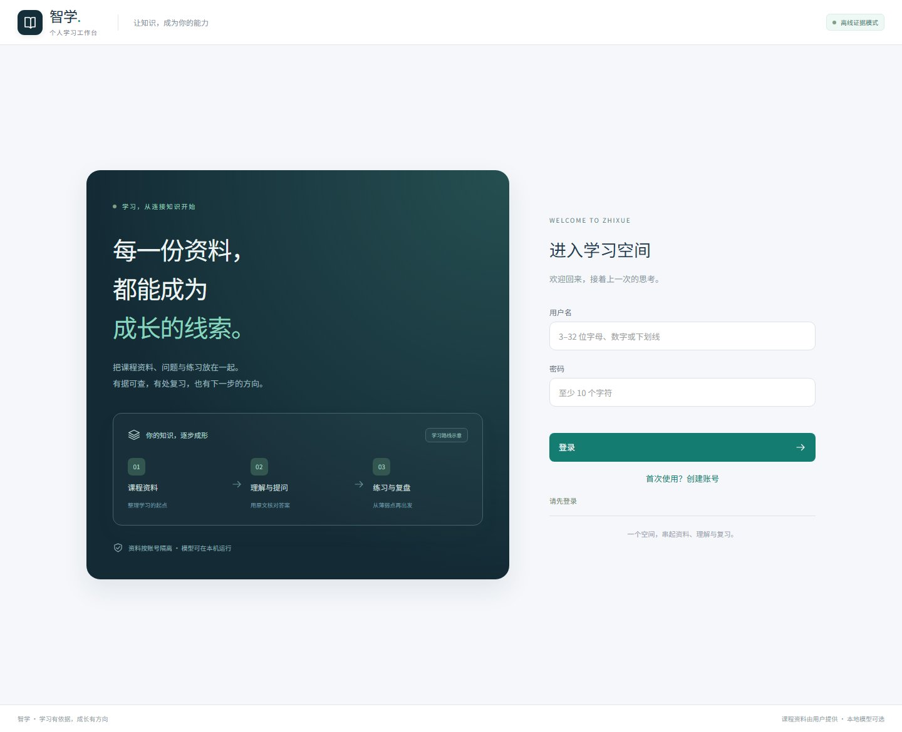
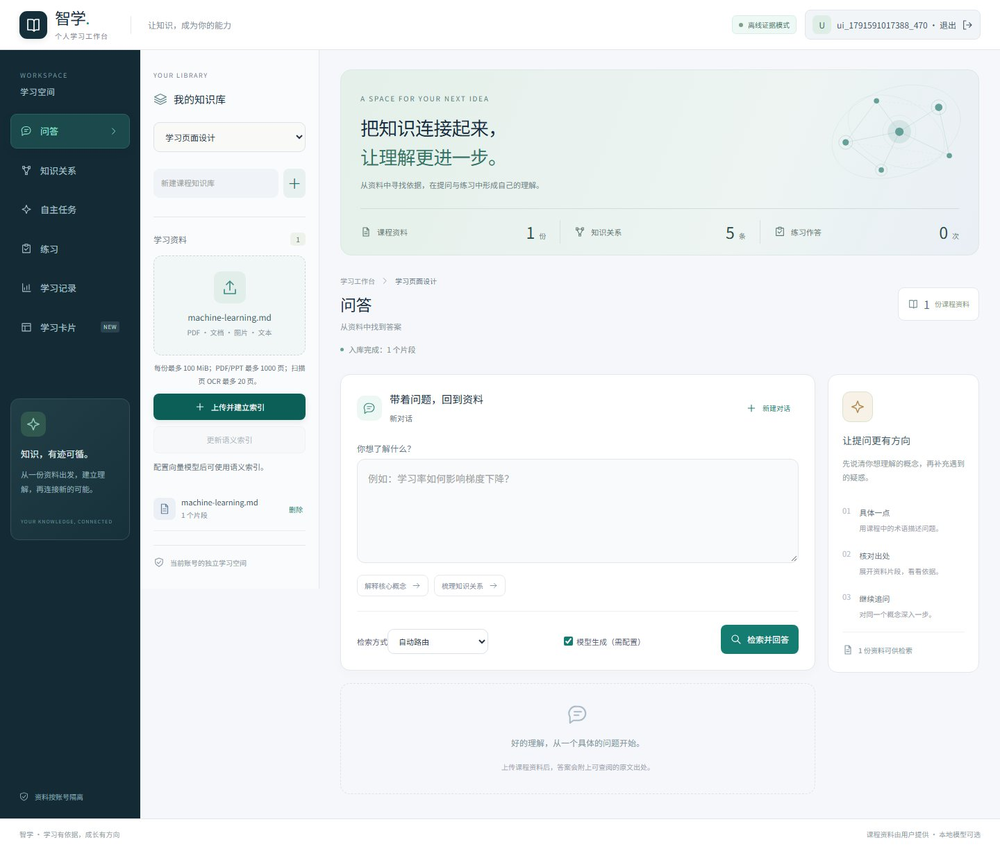
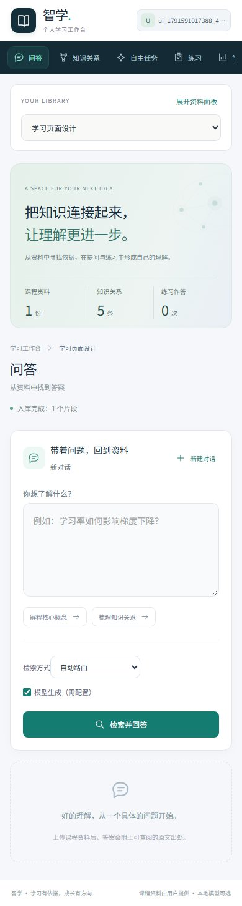
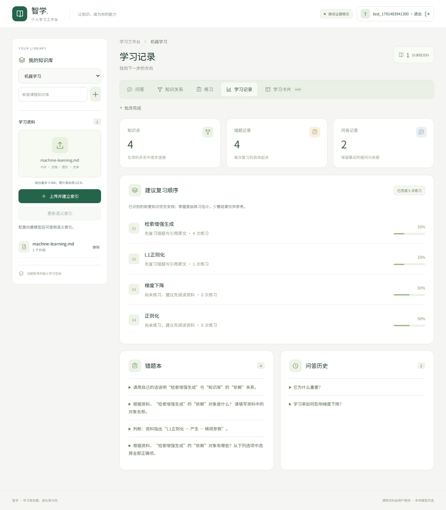
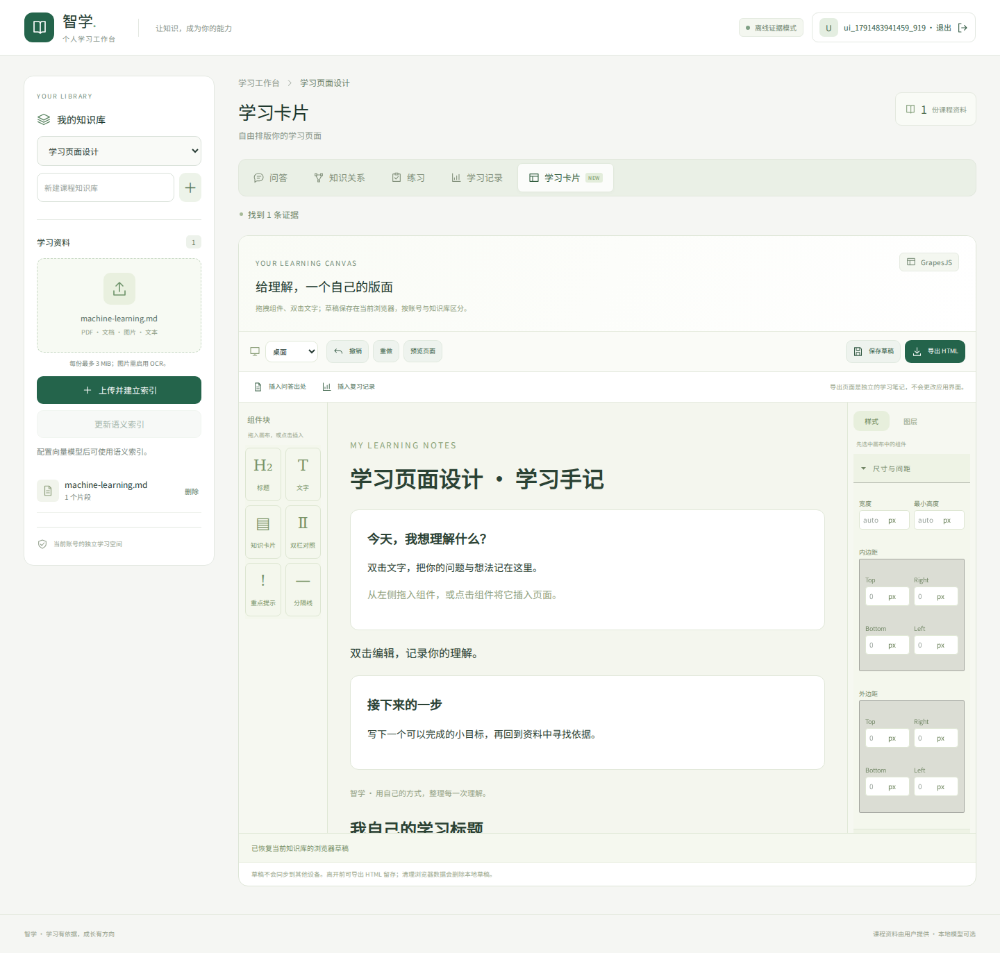
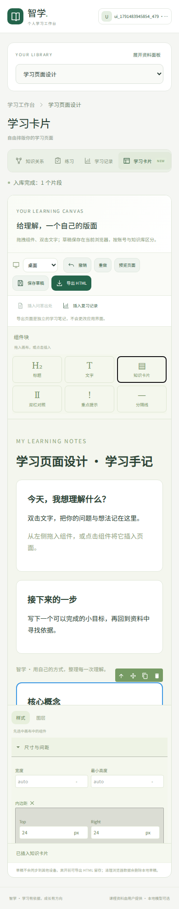

# 前端优化与 GrapesJS 学习卡片

本次优化基于 GrapesJS 官方的组件块、画布、样式面板与设备预览接口，将学习业务页面整理为资料区、学习内容区和操作区。界面样式为项目自己的 Vue/CSS 实现；“学习卡片”页实际运行 GrapesJS 0.23.6。

## 页面改进

- 登录页：学习路线示意、清晰的输入与反馈；示意内容不是用户学习统计。
- 学习工作台：课程资料侧栏、当前课程标题、统一导航、明确的处理状态。
- 资料：拖入或选择文件，显示文件名；手机可展开或收起资料面板。
- 问答：快捷提问、单独的回答与出处卡片，继续追问或开始新对话。
- 知识关系：按实体/关系筛选，关系两端和出处分开显示。
- 练习与记录：题型选择、选中状态、不同批改反馈、掌握度进度与错题历史。
- 键盘使用：跳到学习内容、焦点提示、明确的按钮名称；编辑器组件可用 Enter/空格插入。

## 高级工作台视觉升级（2026-10-10）

使用 MagicPath 插件制作交互设计预览，然后将设计适配到现有 Vue 应用；没有用 React 预览替换项目，也没有增加新的运行时服务。

- 深色功能导航、独立资料面板、浅色学习内容区；小屏改为可横向滚动的功能导航。
- 学习概览显示当前知识库的真实资料数、关系数及练习作答次数；几何连接图是装饰，不是实际知识图谱。
- 登录页、问答卡片、原文出处、知识关系、练习状态统一使用蓝灰与青绿配色。
- 保留原有接口、账号隔离、后台任务、GraphRAG、自主 Agent 与 GrapesJS 编辑器。
- 本地字体由应用打包，页面不需要加载外部字体服务。MagicPath 预览单独嵌入所需字体，避免中文显示为方框。
- 100 MiB 文件、文字 PDF/PPT 1000 页、扫描 OCR 20 页限制保持不变。

以下为新界面的真实浏览器截图，使用测试账号及示例资料：

## 学习卡片

在“学习卡片”页，从左侧拖拽或点击组件，双击画布文字进行编辑。支持标题、文字、知识卡片、双栏对照、重点提示和分隔线；右侧设置样式或查看图层。工具栏支持撤销、重做、桌面/平板/手机预览、保存草稿和导出 HTML。

“插入问答出处”使用当前问答已检索到的原文；“插入复习记录”使用当前知识库的练习统计。这些插入内容是快照，不会随后续问答/练习自动更新。

草稿只保存在当前浏览器的 localStorage，键名按账号 ID 与知识库 ID 区分；不上传后端、不跨设备同步。上限约 100 万字符，超限或存储失败会提示导出。切换页面前也会保存；清除浏览器数据会删除草稿。导出页面是独立学习笔记，不会修改 Vue 应用布局。

编辑器按需加载，因此默认问答/练习页不加载 GrapesJS 的较大代码包。中文画布字体从应用已有字体规则加载；导出 HTML 使用系统字体回退，不包含字体文件。

导出使用 DOMPurify 清理 HTML，禁止脚本、iframe、表单等，并附带禁止脚本执行的 CSP。应用为编辑器允许内联样式，脚本策略仍限定为本站；没有启用自定义脚本或远程编辑器资源上传。

## 后续修改入口

| 文件 | 用途 |
| --- | --- |
| web/src/App.vue | 学习业务布局与现有接口交互 |
| web/src/style.css | 颜色、文字、间距与手机布局 |
| web/src/premium.css | 高级工作台主题与响应式布局；在基础样式之后加载 |
| web/src/components/KnowledgeOrbit.vue | 无交互、无数据含义的装饰连接图 |
| web/src/components/Icon.vue | 统一的 SVG 图标 |
| web/src/components/PageDesigner.vue | GrapesJS 初始化、组件、草稿与导出 |
| web/tests/frontend.spec.js | 真实拖拽、编辑、恢复、导出、设备与手机检查 |
| web/public/third-party-notices.txt | GrapesJS 与 DOMPurify 的许可证 |

官方资料：[GrapesJS 仓库](https://github.com/GrapesJS/grapesjs)、[入门接口](https://grapesjs.com/docs/getting-started.html)、[存储](https://grapesjs.com/docs/modules/Storage.html)、[解析器](https://grapesjs.com/docs/api/parser.html)。依赖版本由 package-lock.json 锁定；开源名称不表示上游团队为本项目背书。

## 实际界面

以下为浏览器自动测试生成的演示账号截图，数据是测试数据。

